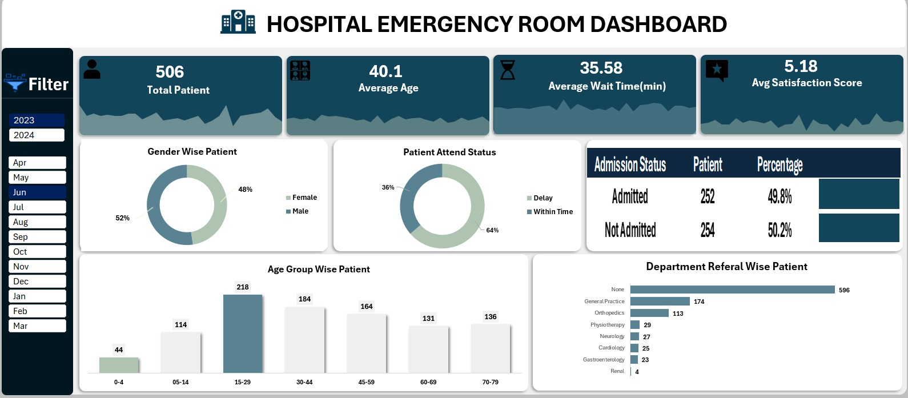

# 🏥 Hospital ER Performance Dashboard

## 🚀 Project Overview
I am thrilled to announce that my latest project, the **Hospital Emergency Room Performance Dashboard**, is now live! 💻✨

This project demonstrates how a fully dynamic and interactive analytical tool can be built entirely within **Excel** by leveraging **Power Query** and **DAX** logic. The goal was to transform raw healthcare data into actionable insights for better hospital management and operational efficiency. 🏥💡

---

## 📊 Key Insights and Metrics Analyzed
The dashboard focuses on critical KPIs to improve patient care and resource planning:

* **Total Patients & Average Age:** Visualizing demographic reach to understand the hospital's primary patient base. 👤
* **Average Wait Time:** Monitoring this critical KPI to ensure operational efficiency and reduce patient delays. ⏳
* **Admission Status:** Analyzing the ratio of admitted vs. non-admitted patients for better resource planning. 📈
* **Department Referrals:** Identifying high-demand departments like **General Practice** and **Orthopedics** for workload management. 👨‍⚕️
* **Satisfaction Scores:** Measuring and analyzing patient feedback to ensure a high-quality care experience. ⭐

---

## 🛠️ Technical Features
To build this robust tool, I utilized advanced Excel functionalities:

1.  **Automated Data Cleaning:** Processed with **Power Query** for accuracy and scalability. 🧹
2.  **Fully Dynamic Dashboard:** Interactive **Slicers** for Year and Month to allow deep-dive analysis. 📅
3.  **Data Modeling:** Implemented **DAX** to calculate complex KPIs and dynamic metrics. 📊
4.  **User-Centric Design:** Focused on clarity, professional aesthetics, and quick decision-making. 🎨

---

## 📥 How to Explore the Project
If you would like to explore the interactive dashboard yourself:
1.  Download the `Hospital Emergency Room Data.csv` file from this repository. 📂
2.  Open it in **Microsoft Excel**. 💻
3.  Use the slicers to filter data and see the visuals update in real-time! 🖱️

🔗 **Full Repository:** [Hospital-ER-Performance-Dashboard](https://github.com/shawon-analyst/Hospital-ER-Performance-Dashboard)

---

> This project is part of my continuous journey in **Data Analytics**, showcasing the advanced capabilities of Excel for business intelligence. I would appreciate your feedback and thoughts! 🤝📩

