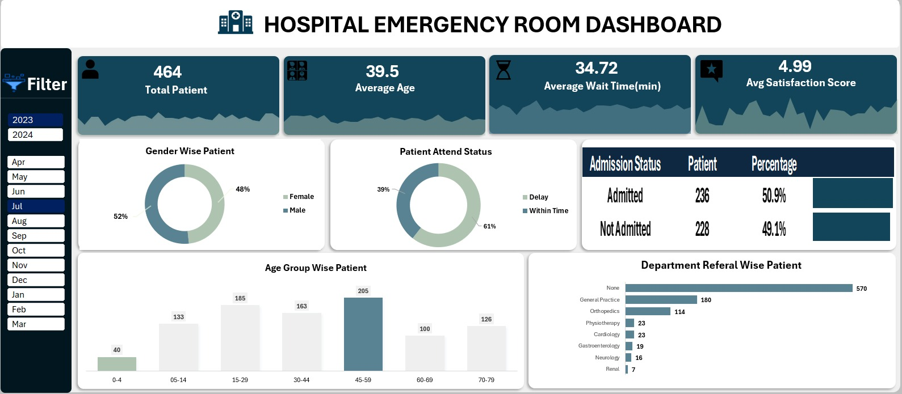

# Hospital-ER-Performance-Dashboard

🚀 Project Showcase: Hospital Emergency Room Analysis (Excel Dynamic Dashboard) 🏥📊

I am thrilled to announce that my latest project, the "Hospital Emergency Room Performance Dashboard," is now live on GitHub! 💻✨

This project demonstrates how a fully dynamic and interactive analytical tool can be built entirely within Excel by leveraging Power Query and DAX logic. The goal was to transform raw healthcare data into actionable insights for better hospital management. 🏥💡

Key Insights and Metrics Analyzed:

- Total Patients and Average Age: Visualizing demographic reach to understand the hospital's primary patient base. 👤
- Average Wait Time: Monitoring this critical KPI to ensure operational efficiency and reduce patient delays. ⏳
- Admission Status: Analyzing the ratio of admitted vs. non-admitted patients for better resource planning. 📈
- Department Referrals: Identifying high-demand departments like General Practice and Orthopedics for workload management. 👨‍⚕️
- Satisfaction Scores: Measuring and analyzing patient feedback to ensure a high-quality care experience. ⭐

Technical Features:

- Automated Data Cleaning: Processed with Power Query for accuracy and scalability. 🧹
- Fully Dynamic Dashboard: Interactive slicers for Year and Month to allow deep-dive analysis. 📅
- Data Modeling: Implemented DAX to calculate complex KPIs and metrics. 📊
- User-Centric Design: Focused on clarity and quick decision-making. 🎨

This project is part of my continuous journey in Data Analytics, showcasing the advanced capabilities of Excel for business intelligence. 🚀

Check out the full repository and documentation here: [https://github.com/shawon-analyst/Hospital-ER-Performance-Dashboard] 🔗

I would appreciate your feedback and thoughts in the comments below! 🤝📩

